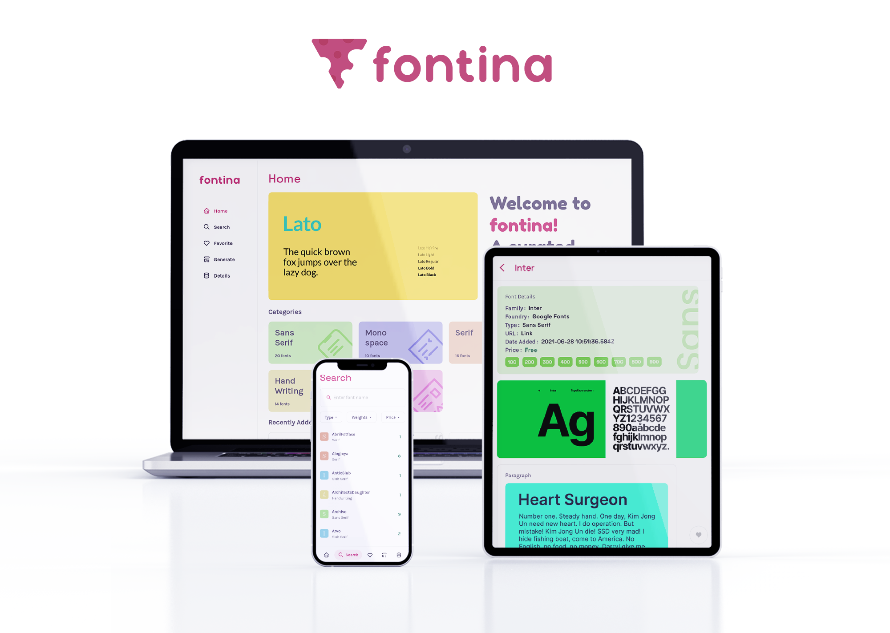

# Fontina

An app which showcases a personally curated collection of fonts. Written in flutter, cross-platform and responsive.
Uses the [Fontgen API](https://github.com/ShreeyansB/fontgen) to display and pair fonts.

## Features
* Beautiful design
* Supports multiple platforms
* View fonts in real-time scenarios
* Filter fonts by type, weight and price
* Favourite fonts which you like
* Caching of data on supported platforms to work offline

> Price of a font indicates if it is free or not for commercial use. Some fonts may be free for personal use.

## Download
Download from [Releases](https://github.com/ShreeyansB/fontina/releases) 
Web App available at [fontina.netlify.app](https://sh-ort.app/tue2h)

If you encounter any bugs, please open an issue on [fontina/issues](https://github.com/ShreeyansB/fontina/issues).
